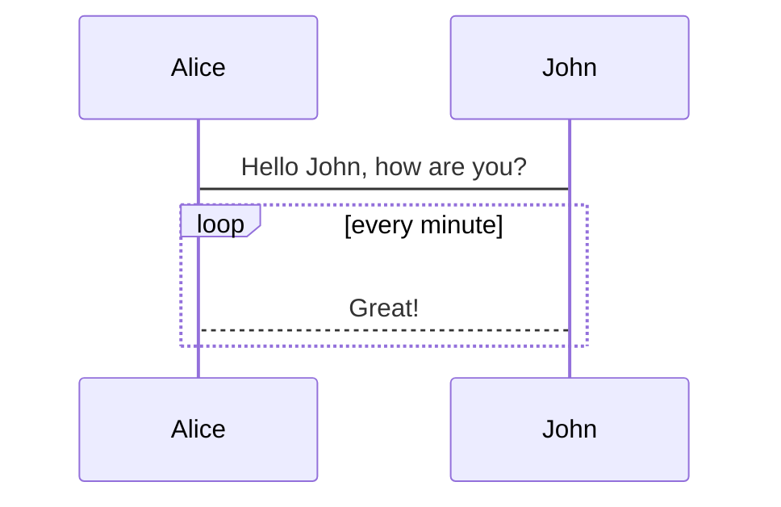

# 문서 제목
주제 내용

## 소제목 1
소제목 내용 1

## 소제목 2
소제목 내용 2

### 소제목 2-1
소제목 내용 2-1

### 소제목 2-2
소제목 내용 2-2

# UML
@startuml
Bob->Alice : hello
@enduml

# mermaid diagram

## Reference
- https://junilhwang.github.io/TIL/Vuepress/Starter/#install
- https://vuepress.vuejs.org/theme/blog-theme.html
